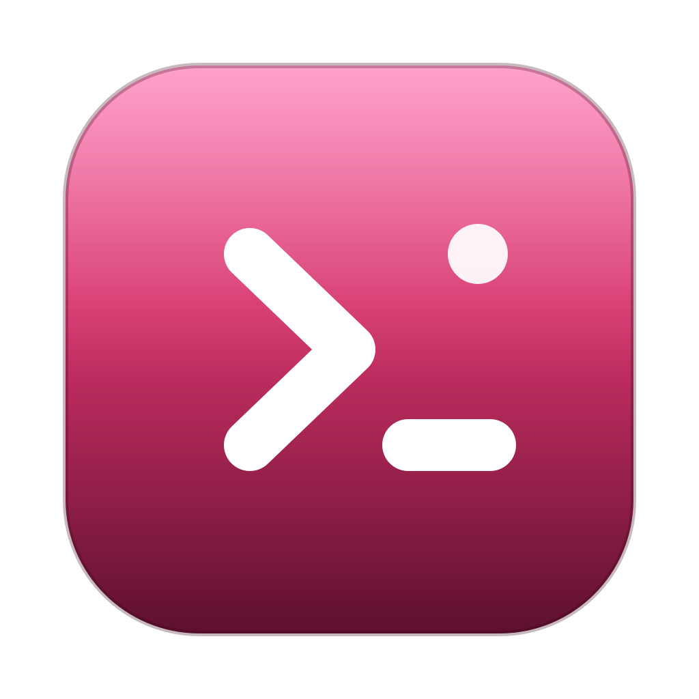

<p align="center">
  
</p>

<h1 align="center">AgentMenu</h1>

<p align="center">
  <strong>Start a terminal coding-agent session in the folder you mean, on the account you mean, at the model and effort you mean.</strong><br>
  Two clicks from the menu bar. No config file to edit, no session to correct after it starts.
</p>

<p align="center">
  macOS 14 or later &middot; Apple Silicon &middot;
  <a href="https://github.com/Facens/agentmenu/releases/latest">Download the latest release</a> &middot;
  GPL-3.0-or-later
</p>

```
┌─────────────────────────────┐
│  Work  │  Personal          │   profile switch
│  5h ▓▓▓░░ 13%  ·  7d ▓▓░ 24%│   rate-limit readout, with its age
│  ◱ Finder: ~/dev/agentmenu  │   the front Finder window
│                             │
│  Hub              opus  high│   saved preset, shown before you click
│  Compliance PU              │
│  Home facens          ⚠︎     │   ⚠︎ = this target bypasses the agent's prompts
│                             │
│  ⚙ Settings        ⏻ Quit   │
└─────────────────────────────┘
```

Changing model or effort inside a running agent session costs tokens and
attention: the session is already loaded when the correction happens. AgentMenu
moves that choice to launch time, where it belongs.

## Install

**Apple Silicon only.** The build is arm64 and does not run on an Intel Mac.

1. Download `AgentMenu-<version>.zip` from the
   [Releases page](https://github.com/Facens/agentmenu/releases).
2. Unzip it.
3. Move `AgentMenu.app` to `/Applications`.
4. Open it.

The app is signed with a Developer ID and notarized, so it opens with no
warning — no right-click dance, no trip through System Settings.

## What it does

- **Launch targets:** folders you configure, the folder of the front Finder
  window, and `$HOME` (which is there on first run, before you configure
  anything).
- **A preset per entry:** agent, terminal, account profile, model, effort,
  permission mode and advisor state. An entry overrides only the fields it
  cares about; the rest inherit from the global default. One folder can have
  several entries — the same project on the work account and on the personal
  one, or on opus and on sonnet — and the duplicate button makes the second
  one from the first, so only the value you want to change is left to change.
- **A one-shot override:** expand a row, change model or effort, launch. The
  saved preset is untouched unless you explicitly save it to the folder or to
  the global default.
- **Two accounts, kept apart:** the dropdown is separated by profile, so a work
  folder cannot be launched on the personal account by mis-click.
- **Rate-limit readout:** 5-hour and weekly consumption per account, with how
  old the reading is — never presented as current when it isn't. The menu-bar
  icon turns into a meter when an account is near its limit.
- **Agents and terminals are data.** Each is a manifest file; adding one is a
  file you write, not a fork you maintain. See
  [docs/adding-an-agent.md](docs/adding-an-agent.md) and
  [docs/adding-a-terminal.md](docs/adding-a-terminal.md).
- **A launch is a full command**, with the agent binary's absolute path and an
  environment prefix. It never depends on a shell alias or a shell function, so
  it works regardless of how your shell is set up.
- **It never writes to your agent's configuration.** AgentMenu reads
  `settings.json` once to seed its defaults and otherwise leaves your agent
  directories alone. The single exception is the status-line bridge, which
  you install deliberately from Settings, and which names the file and the
  key it changes before writing.

### Agents and terminals

| | Status |
|---|---|
| **Claude Code** | Verified end to end (against 2.1.266). The default. |
| Codex, OpenCode | Manifests are present, disabled and marked unverified: the flags were not executed, so the app will not pretend otherwise. Enable one in Settings once you have checked it. |
| **iTerm2** | Verified. The default terminal. |
| Ghostty, Terminal.app | Present, disabled, unverified — same rule. |

Every one of these is a small TOML file under `Resources/`, and a file with the
same `id` in `~/.config/agentmenu/agents/` or `~/.config/agentmenu/terminals/`
overrides it on your machine alone.

## First run

With no `~/.config/agentmenu/config.toml`, AgentMenu writes one that already
works before it asks you anything: the agent whose binary it can find, the
terminal that is installed, the account profiles whose configuration
directories exist, and `$HOME` as a launch target. Then the popover shows a
setup card with the two decisions it cannot make for you — which agents to use,
and which project folders — and detects the git checkouts under the usual code
directories to make the second one a matter of ticking boxes.

The card stays in the popover until at least one real project folder is
configured. Everything else — renaming accounts, more folders, the status-line
bridge — lives in Settings.

## The rate-limit readout

Claude Code hands rate-limit data to exactly one place: the standard input of
your `statusLine` command. There is no `claude usage` subcommand, and hooks
receive nothing. So AgentMenu reads a small snapshot file that a status-line
bridge writes.

Install it from **Settings → Accounts**, per account. It writes the bridge
script into that profile's configuration directory and points `statusLine` at
it. If you already have a status-line command, the bridge **calls yours and
passes its stdin through**, so your status line keeps working — installing is
additive, not a replacement.

Two consequences worth knowing:

- The reading is only as fresh as your last session — the snapshot updates while
  an agent session runs, throttled to once a minute. After an idle evening it is
  hours old, and AgentMenu shows that age rather than pretending.
- With no snapshot for an account, the readout is hidden entirely.

## 🔎 "I installed it and nothing appeared"

**It is almost certainly your menu-bar manager, not the install.** Ice,
Bartender, Hidden Bar and friends park a *new* status item in their hidden
section, and the standard macOS positioning key does not override that — we
verified it: the item lands off-screen at x ≈ -4000 and reports itself as
present the whole time.

Open your menu-bar manager and unhide AgentMenu (in Ice: reveal the hidden
section and drag the AgentMenu item out of it). The app is running; the icon is
just parked.

## There is no command-line tool

Earlier versions of this README documented `agentmenu` as a typed command —
resolving a folder's account from a shell script, importing an old launcher's
list, installing the status-line bridge. That is reversed: nothing puts
`agentmenu` on your `PATH`, and there is no supported way to type it yourself.

The CLI at `Contents/Resources/bin/agentmenu`, inside the app bundle, still
exists, but it is internal. The app invokes it itself — to install the
status-line bridge — and the bridge script it writes invokes it again on every
refresh. See
[docs/migrating-from-cc-launcher.md](docs/migrating-from-cc-launcher.md) if
you're coming from the old shell-based setup.

## Build from source

**Xcode is not required.** Command Line Tools plus SwiftPM is the whole
toolchain.

```sh
git clone https://github.com/Facens/agentmenu.git
cd agentmenu
make bundle          # -> dist/AgentMenu.app
make test            # the AgentMenuKit suite
open dist/AgentMenu.app
```

`make bundle` signs with the maintainer's Developer ID Application
certificate when it is in the keychain. On any other machine — yours, most
likely — there is no certificate, so it signs ad hoc instead and says so with
a banner. An ad-hoc build runs on the machine that built it; it will not pass
Gatekeeper anywhere else and cannot be notarized.

The test suite is a plain executable target, not an XCTest bundle: neither
XCTest nor swift-testing exists in a Command Line Tools install, and requiring
Xcode to run the tests would make "no Xcode" true only for the maintainer.

## Contributing

The cheapest useful contribution is a manifest for an agent or a terminal you
have actually run, and it needs no licence grant at all. Code contributions do
carry one; [CONTRIBUTING.md](CONTRIBUTING.md) says what and why, upfront.

## Licence

GPL-3.0-or-later. See [LICENSE](LICENSE).

A paid version may exist later. If it does, it will be **code that is never
published**, not a relicensing of this repository — what is GPL here stays GPL.
Contributions carry a grant that permits that; it is stated upfront in
[CONTRIBUTING.md](CONTRIBUTING.md) rather than announced afterwards. The
cheapest useful contribution — an agent or terminal manifest — needs no grant at
all.
